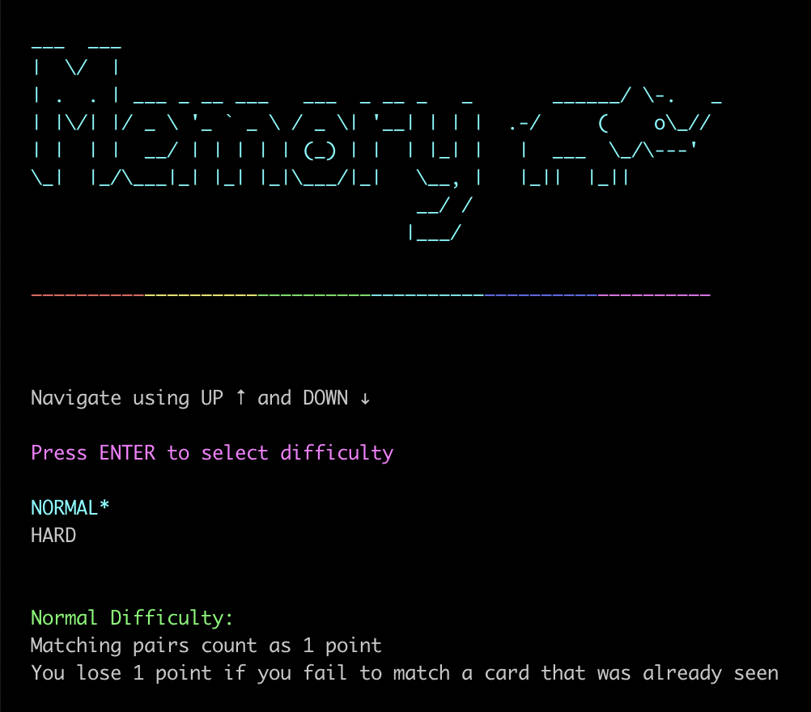
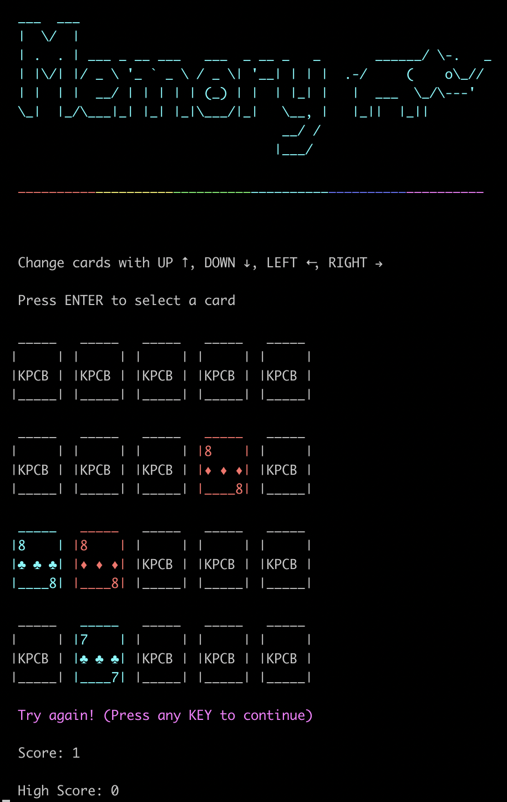

# Memory

<pre>
___  ___                                
|  \/  |                                
| .  . | ___ _ __ ___   ___  _ __ _   _       ______/ \-.   _ 
| |\/| |/ _ \ '_ ` _ \ / _ \| '__| | | |  .-/     (    o\_//
| |  | |  __/ | | | | | (_) | |  | |_| |   |  ___  \_/\---'
\_|  |_/\___|_| |_| |_|\___/|_|   \__, |   |_||  |_||
                                  __/ /
                                 |___/
</pre>

A command-line based version of the card game memory created for the 2020 KPCB Fellowship application.

## Running the game

*Note this game does not work on Windows*

1. Clone or download this repository directly
2. Install Python 3.5+ and Pipenv (this won't run on Python versions lower than 3.5)
    - To install `pipenv`, make sure `pip` is installed and run `pip install pipenv`
3. Inside the repository, run `pipenv install`
4. Run the game using `pipenv run python main.py` (for optimal experience open the console with fullscreen)
    - Some display errors may occur if the terminal window size is too small because I didn't have time to iron them out

## Tests
* Run tests with `pipenv run nosetests --exe`

* Unit tests exist for core game logic:
    - Card selection (skipping over matched cards and other edge cases)
    - Scoring and matching cards (all edge cases)
    - Card values
* All other methods are mainly presentational such as the display logic and were tested by playing the game

## Rules

The objective of the game is to find all matching pairs of cards and maximize score by remembering the locations of cards that have been seen. Each turn, the user selects two cards to flip over and check if there is match. After flipping over the first card, if the user has already seen the location of its respective matching card and the "forget" the location, their score will be penalized. If a successful match is found, their score will increase depending on the selected difficulty. The game continues until all matching pairs are found. In this version, there are 10 pairs of cards (20 cards total) that must be matched.

### Game Modes

#### _Normal_

The user scores 1 point for every successful match, and loses 1 point when they fail to find a match for a card they have already seen.

#### _Hard_

The user scores 3 points for every successful match. _Every_ unsuccessful match causes the user to lose 1 point and failing to match a previously seen card results in 2 points lost.

## Implementation

At a high level, the game is split into the Game, Card, and Display classes.

The Card class simply stores a card's value and suit, and a method for printing itself onto the game board.

The Display class houses all presentation logic and abstracts this away from the Game class. I chose to create an abstract base Display class and then create derived WelcomeDisplay and GameDisplay classes to modularize displays based on use case. In the future if more screens or modes were to be added, it would be easy to add new displays.

The Game uses both the Card and Display classes and holds all of the core game logic including matching, scoring and handling user input. To keep track of the already seen cards for scoring, I used a hash map and stored the card values along with their location.

I also created files for Enums and constants that are reused throughout classes to keep things consistent and easily modifiable.

## Language and Libraries

I chose to use Python mainly because it is easy to use and I am comfortable with it. It also has a plethora of useful libraries that I was able to use for this project. For displaying the game on the command line, I used the `blessed` library which is based off of `curses` and provides a simple but flexible API for creating nice command line displays. I also used `colorama` to display colored text.

I used `nose` as my test runner since it extends the built-in Python `unittest` framework, has good documentation, and makes it easy to setup test classes and functions.

For the ASCII text, I used `patorjk`'s [Text to Ascii Art Generator](http://patorjk.com/software/taag) and borrowed the nice elephant drawing from http://ascii.co.uk/art/elephant :).

## Screenshots

